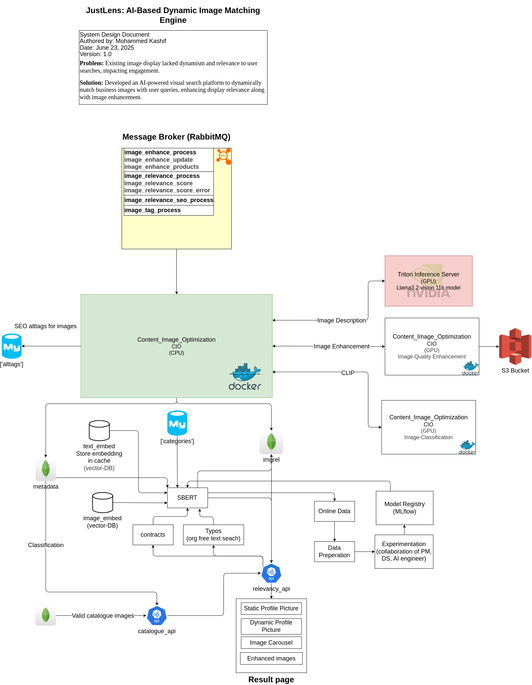

<!-- # Multi-modal-Profile-Image-Optimization-System -->

# JustLens – AI-Based Dynamic Image Matching Engine

## 1. What It Does
JustLens ingests business images, enhances their visual quality, tags them with CLIP embeddings, and serves the most relevant set to end-users in under 200 ms.

## 2. High-Level Flow
1. **RabbitMQ** queues (`image_enhance_process`, `image_relevance_process`, etc.) receive image tasks.
2. **CPU container** (`Content_Image_Optimization : CIO`) pulls tasks, round-robins them across GPU services.
3. **GPU services**
   * *Image Quality Enhancement* – super-resolution and denoise
   * *Image Classification* – CLIP embedding generation
4. **Triton Inference Server** hosts Llava 7 B and Llama-3.2 11 B vision models for prompt-based relevance. For setup of Trition inference server refere this [REPOSITORY](https://github.com/KASHIFMD/LLM-Inference-Optimization)
5. Results, metadata, and alt-tags are stored in **MongoDB** (`imgrel`, `metadata`, `alttags`) and **S3**.
6. [Runtime] **Relevancy API** merges scores, returns JSON for the **result page** (static, dynamic images, carousel). If relevancy score is not computed yet, then `Classification Rule-Set` is applied. 
7. [Runtime] Classification Rule-Set:
For the set of images, one class classified images for the particular business images are marked as `0` or `1`. Such that, only those images selected which are marked as `1` in the descending order of `quality` score of image. This quality of image is computed from the different process, which is part of image metadata generation pipeline (not mentioned in this repo)


## 3. Key Containers [CIO - content_image_optimization]
| Name | Purpose | Tech |
|------|---------|------|
| `rabbitmq` | Message broker | RabbitMQ |
| `cio-cpu` | Orchestrator, queue consumer | Python 3, aiohttp |
| `cio-gpu-enhance` | SRGAN-based enhancer | PyTorch, CUDA |
| `cio-gpu-clip` | CLIP image encoder | PyTorch, CUDA |
| `triton-server` | Inference for Llava and Llama-3 vision | NVIDIA Triton |
| `relevancy_api` | Ranker service | FastAPI |
| `catalogue_api` | Valid catalog image checker | FastAPI |

## 4. Queues
* `image_enhance_process` – raw jobs
* `image_enhance_update` – write-backs after GPU success with purge image to CDN
* `image_relevance_process` – image description generation
* `image_relevance_score` – image relevancy score computation between image description and listed categories of that business
* `image_relevance_seo_process` – CLIP similarity scoring
* `error.*` – DLQ for any failure branch  

Prefetch `=1` on the consumer keeps acknowledgment strict but GPU concurrency is handled inside the CPU orchestrator via asyncio and a round-robin URL picker.

## 5. Data Stores
* **MongoDB**  
  * `imgrel` – image relevancy scores  
  * `metadata` – product metadata, image description, classification and flags
  * `catalogue_details` – product details (images and contracts)
* **S3** – original and enhanced images

* **MySQLDB**  
  * `alttags` – SEO alt-text 
  * `categories` – list of categories associated with the particular business

* **Milvus-vector-DB**  
  * text embeddings(free text searched and categories)(at word level)
  * image-description embeddings

<!-- ## 6. Repository Structure

### # To be added -->

## 6. System Design


## 7. Deployment (single node example)
```bash
# RabbitMQ
docker run -d --name mq -p 5672:5672 rabbitmq:3-management

# CPU orchestrator
docker compose -f docker-compose_cpu.yml build
docker compose -f docker-compose_cpu.yml up -d
docker exec -it content_image_optimization bash

# GPU enhancer
docker compose -f docker-compose_gpu.yml build
docker compose -f docker-compose_gpu.yml up -d
docker exec -it content_image_optimization bash

# Triton
   sudo docker run -it --net host --shm-size=2g \
       --ulimit memlock=-1 --ulimit stack=67108864 --gpus '"device=MIG-ID-01,MIG-ID-02"' \
       -v /rel_path_triton_server/tensorrtllm_backend:/tensorrtllm_backend \
       -v /rel_path_triton_server/models:/models \
       -v /rel_path_triton_server/tutorials:/tutorials \
       -v /rel_path_triton_server/docker_scripts:/docker_scripts \
       -v /rel_path_triton_server/server:/server   \
       -e MODEL_NAME_Llava_7b=llava-1.5-7b-hf \
       -e MODEL_NAME_Llama_11b=Llama-3.2-11B-Vision-Instruct \
       nvcr.io/nvidia/tritonserver:25.03-trtllm-python-py3
   ```

   Change the MIG-ID-01 and MIG-ID-02 ids with your GPU ids. if there is no GPU partition remove `'"device=MIG-ID-01,MIG-ID-02"'` part.

   Change `nvcr.io/nvidia/tritonserver:25.03-trtllm-python-py3` with the tag you want for your Triton server container (make it latest if using for the first time)

   LINK: `https://catalog.ngc.nvidia.com/orgs/nvidia/containers/tritonserver/tags`

   - `-it`: Allows you to interact with the container via terminal — like you would with an SSH session. You can use `-d` to make terminal to be detachable.
   - `--net host`: Uses the host machine’s network stack directly inside the container.
   - `--shm-size=2g`: Sets the shared memory size (/dev/shm) to 2 GB. Avoids memory errors for apps (like PyTorch, TensorRT, OpenCV) that rely on shared memory.
   - `--ulimit memlock=-1`: Sets the maximum locked-in-memory address space to unlimited. Allows processes in the container to lock memory (prevent it from being swapped to disk). Required for performance-critical apps like GPU inference engines.
   - `--ulimit stack=67108864`: Sets the stack size limit to 64 MB (in bytes). Prevents stack overflow errors in deep recursion or heavy multithreaded GPU workloads.
   - `-v`: Mounts directories from host to container (bind mounts)
   - `-e`: Sets environment variables (e.g., MODEL_NAME_Llava_7b)

## 8. SBERT models Continuous Retraining

* Sub‑word + BPE augmentation – The SBERT tokenizer is re‑trained on live search logs (character n‑grams, byte‑pair merges) to minimize out‑of‑vocabulary tokens for colloquial and miss‑typed queries.

* Online data capture – Raw queries are appended to the Online Data store every hour. A nightly Data Preparation job merges, cleans, and stratifies this corpus.

* Experimentation loop – Data Scientists run MLflow experiments on the refreshed corpus; results are pushed to the Model Registry.

    * Key metrics:

        STS regression: Spearman’s ρ on STS‑B dev

        Paraphrase / duplicate: F1‑score on QuoraBQ hold‑out

        Retrieval: MRR@10 on an MS MARCO slice containing ≥ 10 % OOV terms

* Promotion rule: Deploy a new checkpoint when its primary metric improves by ≥ 2 % over the previous best and the batch‑encode latency (128 sentences) stays < 20 ms

* Shadow deployment – Newly promoted SBERT models run in parallel for 5 % traffic; drift and error rates are compared before 100 % cut‑over.

### SBERT Metric Glossary

- STS regression – Semantic Textual Similarity framed as a regression task (score 0‑5). We track Spearman ρ, Pearson r or MSE to judge how well the embeddings capture graded similarity.

- QuoraBQ hold‑out – Reserved evaluation slice from the Quora Question Pairs / Quora Benchmark Questions dataset. It provides the F1 benchmark for our paraphrase / duplicate‑detection task.

- MRR – Mean Reciprocal Rank. For every query we take 1 / rank of the first relevant result, then average across queries. Higher = better early precision in retrieval.

- MS MARCO – Microsoft MAchine Reading COmprehension web‑search corpus (queries, passages, relevance labels). We report MRR@10 on a slice that contains at least 10 % OOV queries.


